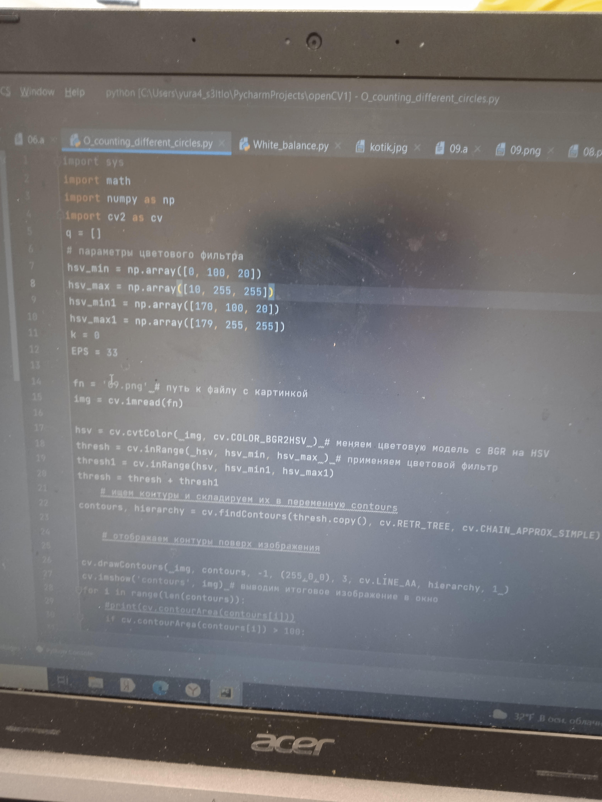

30.11.2021
==
Сделал несколько фоток ребят (и себя) в оранжевых бейджиках дневного пансиона

11.12.2021
==
Сделал порядка 30-35 фоток ребят, себя, бейджиков отдельно всех цветов и видов, на некоторых фотках неудачно расположены бейджики, которые не фоткаются, у меня футболка имеет цвета недельного и полного пансиона - усложнение задачи. Также некоторые предметы рядом имеют тот же цвет, что и бейджик на некоторых фотках. Предстоит решить эту проблему

17.12.2021
==
Пришла в голову идея, что при решении задачи с распознаванием бейджиков моэет быть полезно моё частичное решение задачи на распознание разноцветных кружков из контеста.

Начинаем решать задачу, подгоним цвет для бейджика дневного пансиона(оранжевый)
`hsv_min = np.array([10, 100, 20])
hsv_max = np.array([20, 255, 255])` и параметры площади (смотрим только объекты, пложадь которых больше 300, чтобы исключить ненужные блики)
`for i in range(len(contours)):
    if cv.contourArea(contours[i]) > 300:
        print('Ученик, дневной пансион')`

Возникают первые проблемы - цвет выделяет не тот, а из-за слишком большого изображения тяжело подгонять, изменим размер функцией `cv2.resize()`

21.12.2021
==
В файле checker удалось провести уменьшение размеров изображение с функцией `cv2.resize()`
В файле main были определены пороговые цвета для оранжевого цвета `hsv_min = np.array([12, 100, 20])
hsv_max = np.array([15, 255, 255])

22.12.2021
==
Появилась программа для нахождения пороговых значений цвета (подбор диапазона цветной.py) загружены простые фотки дневных пансионов с индексами _simple (blue_simple, purple_simple)
`

23.12.2021
==
Определены пороговые значения для голубого бйджика недельного пансиона. Выделяет правильно бейджики на всех тестах, на тестах blue_4, blue_hard, blue_simple находит лишние элементы (окно и т.п.), на всех остальных тестах для голубого цвета программа работает корректно
